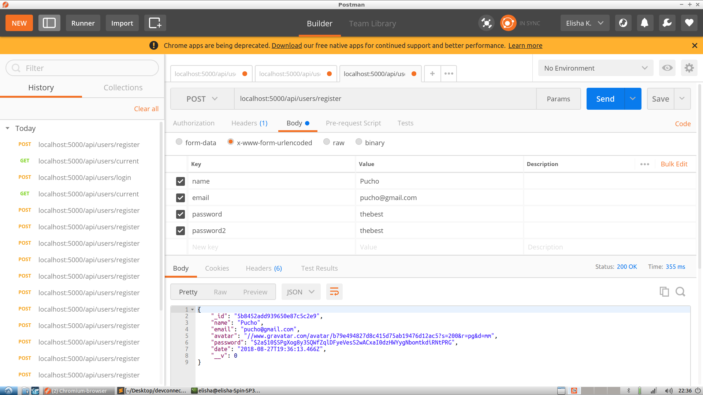
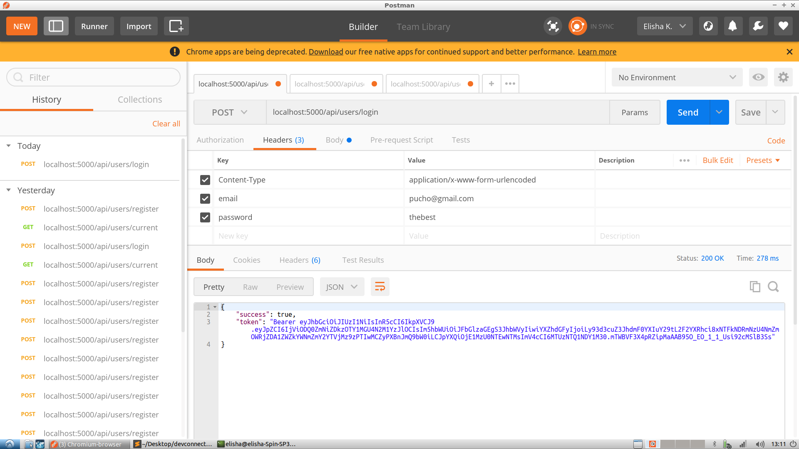
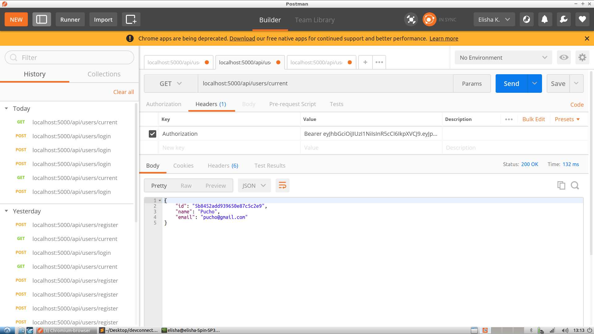

<h1>Using JWT Tokens with React and NodeJS</h1>

This Post is based on Brad Traversy's Udemy Course: <a href="https://www.udemy.com/mern-stack-front-to-back/">MERN Stack Front To Back: Full Stack React, Redux & Node.js</a>

You can find the repo in the state described within this post on <a href="https://github.com/bradtraversy/devconnector/tree/c206c0659642dc396df0c47ea0475e29535e5f91">this branch of the repo.</a>

Getting started: 

1) Npm install the server and client folders

2) Within the file '/config/keys.js', change the MONGO_URI value to a mongo link from mLab (or a locally running Mongo Connection Credentials). 

It should look something like this:

```
mongodb://<dbuser>:<dbpassword>@ds235352.mlab.com:35352/devconnectoramp
```

3) Install 2 Chrome Extensions:
- <a href="https://chrome.google.com/webstore/detail/react-developer-tools/fmkadmapgofadopljbjfkapdkoienihi">React Dev Tools</a>
- <a href="https://chrome.google.com/webstore/detail/redux-devtools/lmhkpmbekcpmknklioeibfkpmmfibljd">Redux Dev Tools</a>

<h3>The API Routes</h3>






<h3>Login and Register Components</h3>

We are not using Redux-Form.

Instead, our errors are coming back straight from the server.

 Errors will be coming in as props from the reducer,
  and then, we are going to add props to state via the 'componentWillReceiveProps' lifecycle method


Within our Login Form:

If the user goes to '/login', and he is already authenticated,
he will automatically get redirected to the dashboard:

```javascript
 componentWillReceiveProps(nextProps) {
    if (nextProps.auth.isAuthenticated) {
      this.props.history.push('/dashboard');
    }

    if (nextProps.errors) {
      this.setState({ errors: nextProps.errors });
    }
  }
```

<h3></h3>


Once you're logged in, within your browser, if you type:

```javascript
console.log(localStorage.getItem('jwtToken'))
// it will return: Bearer eyJhbGc....
```

This is because, once we get the token from the server (with the right combo of email and password), we save that token to localStorage. Doing that allows us to update our Redux store based on whether or not there's a token within local storage.

Our Redux store then allows us to dynamically change the views based on whether the user is logged in or not.

So: Within the main App.js file, we import 2 actions from authActions file.


```javascript
import { setCurrentUser, logoutUser } from './actions/authActions';

...

// Check for token
if (localStorage.jwtToken) {
  // Set auth token header auth
  setAuthToken(localStorage.jwtToken);
  // Decode token and get user info and exp
  const decoded = jwt_decode(localStorage.jwtToken);
  // Set user and isAuthenticated
  store.dispatch(setCurrentUser(decoded));

  // Check for expired token
  const currentTime = Date.now() / 1000;
  if (decoded.exp < currentTime) {
    // Logout user
    store.dispatch(logoutUser());
    // Clear current Profile
    store.dispatch(clearCurrentProfile());
    // Redirect to login
    window.location.href = '/login';
  }
}

```

The logic is:

- If the jwtToken exists in localStorage
-------> Decode the token (this will give us back a real user object - instead of some 'Bearer...' gibberish we saw above.)
-------> We then take that user object and run this function:

```javascript
store.dispatch(setCurrentUser(decoded));
```

Let's have a closer look at what this line does.

```javascript
// actions/authActions.js file. Set logged in user

export const setCurrentUser = decoded => {
  return {
    type: SET_CURRENT_USER,
    payload: decoded
  };
};

```

We're passing in a decoded user object and creating an action object. This new object is then dispatched to the reducer via the dispatch method. Here's what the reducer does with it:


```javascript
// reducers/authReducers.js file. Set logged in user


const initialState = {
  isAuthenticated: false,
  user: {}
};

export default function(state = initialState, action) {
  switch (action.type) {
    case SET_CURRENT_USER:
      return {
        ...state,
        isAuthenticated: !isEmpty(action.payload),
        user: action.payload
      };
    default:
      return state;
  }
}

```

